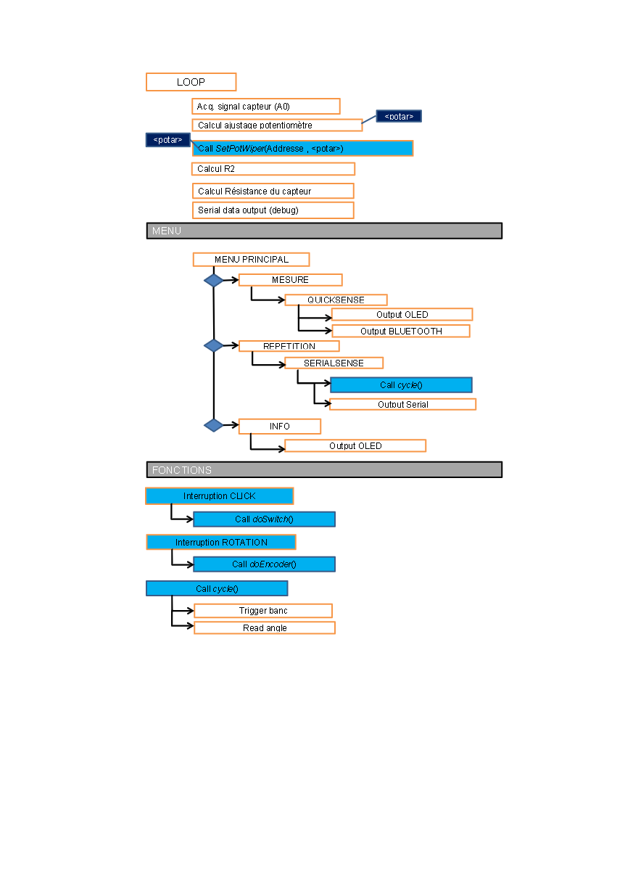
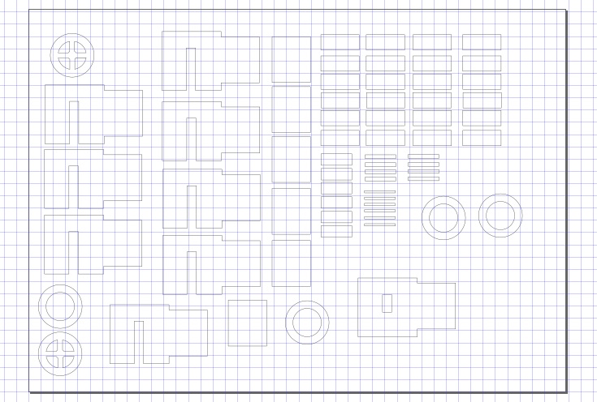

# 2021-2022_Viallaneix_Sottas_Noual MOSH Project 2022
Granulometric sensor

# Informations générales
> Ce projet s'inscrit dans le cadre de l'UF _"Du capteur au banc de test en open source hardware"_.
> Le cœur du projet bat sur fréquence de la **LOW TECH**. Nous partirons de la fabrication d'un capteur granulométrique élaboré à partir d'une feuille de papier sur laquelle une couche de carbone sera déposée à l'aide d'un crayon à papier (panel de dureté entre HB et 9B) selon un motif prédeterminé. À ce corps d'épreuve, deux électrodes insérées aux extrémités du motif permettront la circulation d'un courant. Une déformation du capteur entraînera une variation du courant mesurable par un système d'acquisition de données. Les enjeux du projet sont donc multiples!
* **Physique** : sur les propriétés d'un capteur granulométrique
* **Technique** : sur la conception et le développement d'un système d'acquisition
* **Exploratoire** : par l'utilisation des outils et concepts de l'Open Source Hardware.
* **Se construire une composante _low-tech_  de l'ingénieur que nous serons** : en s'interrogeant sur les attentes d'une société en mutation, en posant un regard critique sur la notion de progrès technique et sa finalité.

# Ce que fait ce projet 

> La finalité du projet est de pouvoir estimer les forces et faiblesses de ces capteurs low-tech. Pour cela nous allons devoir les tester, déterminer leurs caractéristiques et leur limites d'utilisations, autrement dit déterminer leurs datasheets.
> Pour cela nous allons concevoir un banc de mesures qui nous permettra dans un premier temps d'étalonner les capteurs (leurs sensibilités varient en fonction de la dureté) puis dans un deuxième temps de les éprouver dans des conditions et durées d'utilisation variées.
> Les jeux de données issues de ces tests vont vite devenir conséquents et il sera utile de prévoir les scripts et la visualisation en sortie du banc de test et étalonnage.
> La composante **étalonnage** du banc permet d'étalonner un capteur de sensibilité inconnue. La composante  **test** permet de renseigner la datasheet.

# Les étapes
> Dans la suite du projet le capteur désignera le corps d'épreuve et le banc de test permettant l'acquisition des données.
> La première étape consiste à la réalisation du capteur granulométrique. Ce capteur est utilisé pour le développement du banc d'étalonnage

***
## Les axes du projets
> Sommaire à placer
***

### Présentation du capteur granulométrique
### Le capteur
> Hello voici la description du capteur. 
#### Propriété d'un système granulaire
### Acquisition des données
#### La carte Arduino
#### Le conditionneur

#### Partie 1: Mesure d'un très faible courant avec l'aide d'un micro-contrôleur
L’objectif étant d’extraire l’information utile du capteur ayant un très faible courant (environ 100 nA), le montage électrique doit être adapté de manière à mesurer des courants faibles. Selon les caractéristiques techniques du microcontrôleur Arduino (cf Datasheet), on ne peut pas mesurer directement de très faibles courants en raison de l’impédance de source (environ égale à quelques kOhms). Il est donc nécessaire d’utiliser un circuit amplificateur transimpédance composé d’un amplificateur opérationnel AOP pour convertir un courant issu du capteur en une tension mesurable par le CAN (Convertisseur Analogique-Numérique) de l’Arduino UNO.

 
  
**Figure 1: Montage de transimpédance (ou convertisseur courant-tension)**
  

L’inconvénient d’un montage classique de transimpédance est qu’il nécessite une grande résistance pour amplifier le signal et que la tension d’alimentation du capteur doit être négative. On peut donc ajouter un autre étage inverseur à la suite du premier montage : 

 
  
**Figures 2 et 3: Ajout d'un étage inverseur sur le montage de transimpédance et Calcul du gain du second montage**

Dans le montage ci-dessus, le gain du second étage étant négatif compte-tenu de son caractère inverseur (`cf Figure 3`), la résistance R1 du premier étage n’a plus besoin d’avoir une grande valeur. De plus, l’alimentation du capteur est donc positive grâce au second montage inverseur du fait des produits des gains de deux étages. 

Pour plus de simplicité, on a choisi un montage en prenant un seul AOP dans le montage.

 

**Figure 4: Solution simplifiée pour le montage transimpédance**

**Figure 5 : Calcul de la tension aux bornes de R1**

  
En calculant la tension aux bornes de la résistance R1, on obtient une tension environ égale à 10 mV d'après la `Figure 4`.

Il s’agit d’une valeur importante pour le choix de l’AOP notamment pour l'effet de l’offset du signal d’entrée. 
Le Gain de ce montage et la Tension de sortie ADC sont décrits dans les calculs ci-dessous : 

 
  
**Figure 6 : Calculs du gain du montage et de la tension de sortie**

  
Si on a un courant nul en entrée, on veut alors obtenir une tension ADC nulle en sortie, cela implique qu’il n’y ait pas de dérives en tension de la part de l’AOP.
Les principales contraintes pour le choix de l’amplificateur opérationnel sont le faible courant d’entrée et un très faible offset de tension devant être négligeable devant 10mV (tension aux bornes de R1).

##### Vérification avec la Datasheet de l'AOP

Selon les données de la [Datasheet](LTC1050C.pdf) de l'AOP 1050C, on constate qu'il possède un faible offset de tension d'environ 5μV au maximum et un très faible drift pour l'offset de tension à environ 0.05μV/°C. Cela indique la bonne stabilité de l'amplificateur opérationnel. Par comparaison, les AOP utilisés traditionnellement en salle de TP possèdent un offset autour de 5mV, une valeur 1000 fois plus grande que celle du 1050C.
En comparant la tension d'entrée (autour de 10mV `cf Figure 5`), on constate que l'offset de 5μV est très faible. 
De plus, on peut remarquer que cet AOP possède un mode commun incluant la masse ce qui correspond à notre montage électrique. 

> Photo
  

 
  
**Figure 7 : Extrait de la datasheet dans la partie Electrical Characteristics**

  
Enfin, on constate que le courant de polarisation en entrée (Input Bias Current) est au maximum égale à 30pA, cela convient car nous effectuons des mesures de courant autour de 100nA.
En respectant les différentes conditions énoncées précédemment, l'AOP 1050C est adapté pour notre circuit électronique.

#### Partie 2: Mise en oeuvre du filtrage du signal

Étant donné que ce montage est très sensible aux signaux parasites (50Hz, horloge du microcontrôleur Arduino, Bluetooth entre autres), on doit mettre en œuvre un filtrage passe-bas pour limiter les perturbations du signal.
D’une part, il faut appliquer un filtre passif en entrée pour limiter les perturbations de type radiofréquences pouvant conduire à un excès de bruit dans l’ADC.
Ensuite, on applique un filtre actif au niveau de l’amplificateur opérationnel pour augmenter l’efficacité de l’échantillonnage du signal. 
À la sortie de l’AOP, on utilise un dernier filtre passif pour retirer le bruit sur le traitement du signal et les phénomènes de repliement de spectre (aliasing). 

En intégrant les différents filtres, le montage ressemble à ceci : 

  
**Figure 8 : Schéma du montage électrique avec les différents filtres**

On distingue 3 différents filtres où nous avons cherché pour chacun la fréquence de coupure et son rôle principal pour le filtrage : 

> Photo

 
  
**Figure 9 : Identification des différents filtres dans le montage**

  
 
Tout d'abord, le filtre passe-bas passif, placé à l'entrée de l'AOP, est constitué de R1(100kΩ) et C1(100nF). Il possède une fréquence de coupure théorique environ égale à 16Hz `cf Figure 7` . Il permet donc de filtrer les perturbations et les excès de bruit en courant sur la forme du signal d'entrée. 

 

**Figure 10: Calcul de la fréquence de coupure du filtre passif (R1 et C1)**

Ensuite, le filtre passe-bas actif, placé entre l'entrée et la sortie de l'AOP, est constitué de R3(100kΩ) et C4(1μF) en parallèle. Ce dernier possède une fréquence de coupure théorique environ égale à 1.6Hz `cf Figure 8`. Son rôle principal est de supprimer la composante parasite de 50Hz (du fait du couplage capacitif avec la tension 230V) qui perturbe significativement le signal `cf Figure XX`.

 

**Figure 11: Calcul de la fréquence de coupure du filtre actif (R3 et C4)**

Enfin, le filtre passe-bas passif, placé à la sortie de l'AOP, est constitué de R6(100kΩ) et C2(100nF). Il possède une fréquence de coupure théorique environ égale à 1.6kHz `cf Figure 9`. En sachant que la fréquence d'échantillonnage du micro-contrôleur est environ égale à 15,4kHz, il faut respecter la condition d'échantillonnage de Shannon à savoir:  

 

**Figure 12: Calcul de la fréquence de coupure du filtre passif (R6 et C2) et Vérification de la condition d'échantillonnage de Shannon**

Selon les calculs, on respecte bien la condition d'échantillonnage de Shannon `cf Figure ci-dessus`, le filtre permet de limiter les effets de repliement de spectre (rôle d'anti-aliasing) et de manière générale, le bruit lors du traitement du signal. 

#### Schéma du circuit électronique final
> Voici un première proposition du schéma électrique
  

**Figure 13: Premier schéma du montage électronique**

  
Dans ce schéma, nous simulons le bruit en courant à l'entrée en mettant une capacité à côté du générateur de tension. On a ajouté une capacité C3 pour filtrer le bruit de la source d'alimentation.
  
> On propose une optimisation du montage électronique en simulant le capteur de graphite `cf Figure ci-dessous`
  

**Figure 14: Schéma électrique optimisé**

#### Simulations sous LT-Spice
  
On vérifie les conditions optimales de fonctionnement du montage électronique `cf figures ci-dessous`.
> Mettre une image supplémentaire. 

**Figure 15: Vérification du gain d'amplification du signal environ égal 100**

  
Pour l'illustration graphique du gain du montage général, on distingue qu'il y a bien 3 filtres dans le circuit électronique grâce aux différentes variations du terme de phase (courbe en traits en pointillés `cf Figure `).
> Mettre photo 

> On vérifie graphiquement la fréquence de coupure de chaque filtre en effectuant une simulation fréquentielle (AC Sweep):

Pour le premier filtre à l'entrée de l'AOP (R1 et C1):

**Figure 16: Illustration graphique de la fréquence de coupure du filtre (R1 et C1)**

  
Pour le second filtre entre l'entrée et la sortie de l'AOP (R3 et C4) et le dernier filtre à la sortie (R6 et C2):
  

**Figure 17: Illustration graphique des fréquences de coupure des deux filtres passe-bas**

  
> Simulation continue paramétrique (DC Sweep).
> Simulation temporelle (Transient).
> Simulation fréquentielle (AC Sweep).

### Code Arduino du système

> En Cours
###### Tests KiCad & LT-Spice
### Réalisation du PCB
### Banc de tests
> En Cours de réalisation 

 

**Figure 14: Dessin 2D du banc de test**

